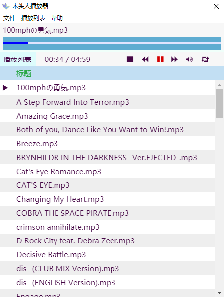

# Chinese

## 名称

锚点播放器（ModellPlayer）

## 版本号

0.0.1

## 简介

无聊之下，写了一个音乐播放器。  
用 `Electron` 编写的媒体播放器，可以播放本地的音乐。  
不能播放远程（网络）文件。  
体积有点大，不过既然是用 `Electron` 写的，那体积问题就可以完全甩锅给 `Electron` 了。  
嗯。
​
### 实现功能

* 可以加入文件和文件夹。
* 可以暂停、停止、上一首、下一首
* 可以顺序、乱序、循环、单曲循环
* 可以最小化到系统托盘
* 可以配置最小化设置
* 可以双击列表中的歌曲名称切换播放歌曲
* 音量调节

### 未来预计实现的功能

* 快捷键操作
* 可以播放 cue 文件等播放列表文件
* 可以调节播放进度
* 更强大的界面操作
* 以及其他暂时没想到的

### 运行

下载链接：[度盘提取码：**fru0**](https://pan.baidu.com/s/1XWUq-68uPNNjJKBG9Zos5A)  

### 实例图

#### 跨平台

本软件支持 Windows 和 Linux 两种操作系统。  
因为我没有 mac ，所以不支持 Mac 操作系统。

测试过的 Linux 平台。

* Deepin

#### Windows
下载、解压之后，直接双击 `ModellPlayer.exe` 即可运行程序。

#### Linux
下载 `ModellPlayer-x86_64.AppImage` ，双击直接运行即可。

## License

Apache-2.0

本软件遵循 Apache-2.0 协议进行开源处理。  
在 Apache-2.0 协议下，可以无偿使用本软件。  
保留 Apache-2.0 协议下的所有权利。

#### 关于 Apache-2.0

> Apache Licence是著名的非盈利开源组织Apache采用的协议。该协议和BSD类似，同样鼓励代码共享和尊重原作者的著作权，同样允许代码修改，再发布（作为开源或商业软件）。需要满足的条件也和BSD类似：
>
> 1. 需要给代码的用户一份Apache Licence
> 2. 如果你修改了代码，需要在被修改的文件中说明。
> 3. 在延伸的代码中（修改和有源代码衍生的代码中）需要带有原来代码中的协议，商标，专利声明和其他原来作者规定需要包含的说明。
> 4. 如果再发布的产品中包含一个Notice文件，则在Notice文件中需要带有Apache Licence。你可以在Notice中增加自己的许可，但不可以表现为对Apache Licence构成更改。
>
> Apache Licence也是对商业应用友好的许可。使用者也可以在需要的时候修改代码来满足需要并作为开源或商业产品发布/销售。
>
> 英文原文：[http://www.apache.org/licenses/LICENSE-2.0.html](http://www.apache.org/licenses/LICENSE-2.0.html)

# English

## Name

ModellPlayer

## Version
0.0.1

## About
This software is a  music player build by electron.
It could play local music file, but can't play remote file.

### Products

* Can open file and folder.
* Can Stop, pause, and play next or last one.
* Can play one file round, round, by list or random.
* Can set window minisize to the tray.
* Can set how to minisize.
* Can double click the name in play list to choose a new file to play.

### Todos

* Hot keys
* Volume setting
* play CUE file
* change progress
* more UI events
* ant the others

### Cross Platform

This software are support windows and linux.
And not support mac os because of I did not hot a mac machine.

The tested Linux platform

* Deepin(Debian base)

## License

Apache-2.0

It means, everyone could use this software under the license of Apache-2.0 as free.

#### About Apache-2.0
[http://www.apache.org/licenses/LICENSE-2.0.html](http://www.apache.org/licenses/LICENSE-2.0.html)